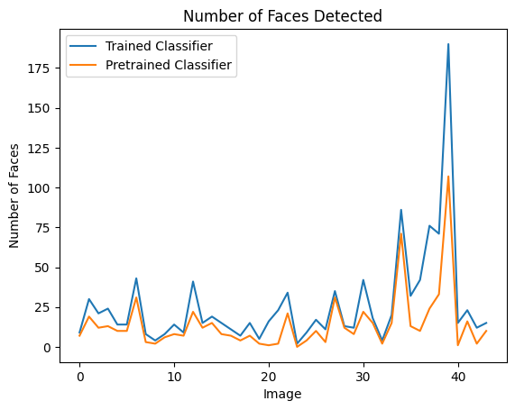

# Face Detection Classifier Comparison

This project demonstrates the comparison between a custom-trained face detection classifier and a pretrained classifier using OpenCV's Haar Cascade Classifier. It includes the code for training a custom classifier, testing it against a set of test images, and visualizing the results.

## Prerequisites

Before running the code, ensure you have the following dependencies installed:

- OpenCV
- Matplotlib
- NumPy

You can install these dependencies using the following command:

```bash
pip install opencv-python matplotlib numpy
```

## Usage

1. Mount Google Drive (if using Google Colab):

```python
from google.colab import drive
drive.mount('/content/drive')
```

2. Set the paths to the necessary directories and files:

   - `positive_images_dir`: Path to the directory containing positive (face) images.
   - `negative_images_dir`: Path to the directory containing negative (non-face) images.
   - `output_dir`: Path to the directory where you want to save the trained classifier.
   - `cascade_xml_file`: Path to the cascade classifier XML file for training.
   - `test_images_dir`: Path to the directory containing test images.

3. Execute the code to train the custom classifier and test it against test images.
   ## Test Images
   
   Here are some test images that you can use to evaluate the custom-trained classifier:
   
   
   *Figure 1: Test Image 1.*
   
   
   *Figure 2: Test Image 2.*
   
   
   *Figure 3: Test Image 3.*

## Code Explanation

- The code trains a custom classifier using positive and negative image samples.
- It uses multiprocessing to speed up the training process.
- The trained classifier is compared with a pretrained Haar Cascade Classifier.
- The results, including the number of faces detected and a visual comparison, are displayed.
- The code also calculates the mean face detection performance and the percentage improvement over the pretrained classifier.

## Results

The code produces visual comparisons of face detection results between the custom-trained classifier and the pretrained classifier for each test image. It also includes a bar graph showing the number of faces detected by both classifiers for each test image.


*Figure 4: Comparison of face detection results for both the classifiers Image 1.*


*Figure 5: Comparison of face detection results for both the classifiers Image 2.*


*Figure 6: Comparison of face detection results for both the classifiers Image 3.*


*Figure 7: Comparison of face detection results for both the classifiers Image 4.*


*Figure 8: Comparison of face detection results for both the classifiers Image 5.*


*Figure 9: Comparison of face detection results for both the classifiers Image 6.*


*Figure 10: Line Graph of face detected results for both the classifiers.*


*Figure 11: Improvement btw both the classifiers for face detection.*

## License

This project is licensed under the MIT License. See the [LICENSE](LICENSE) file for details.
